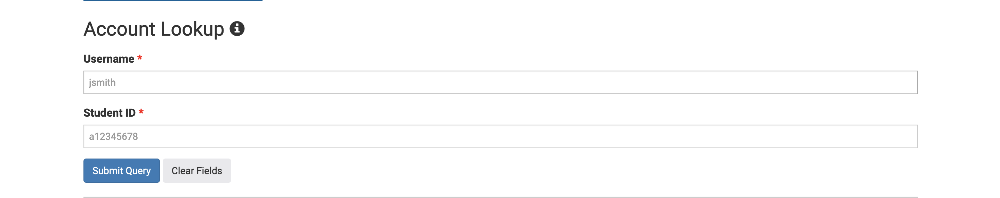
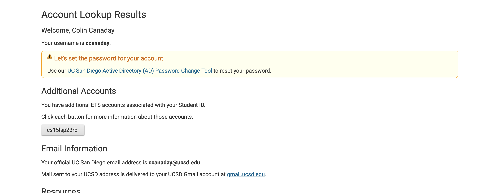
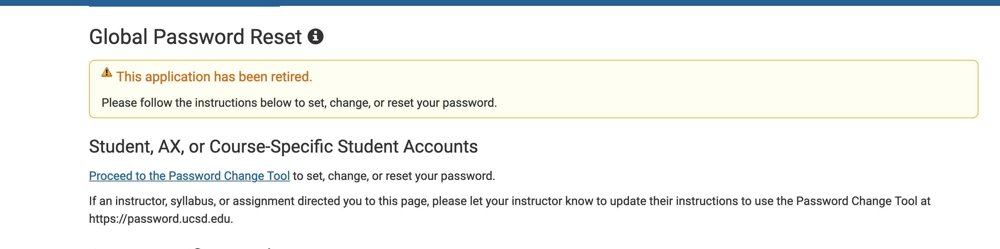
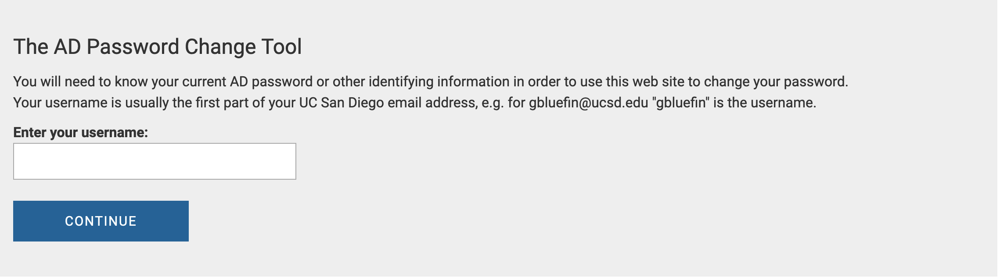
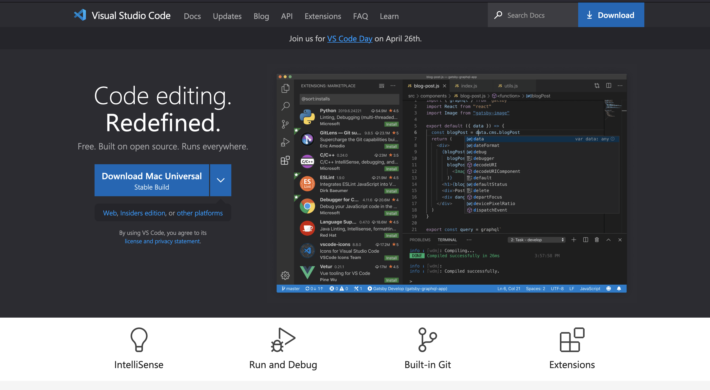
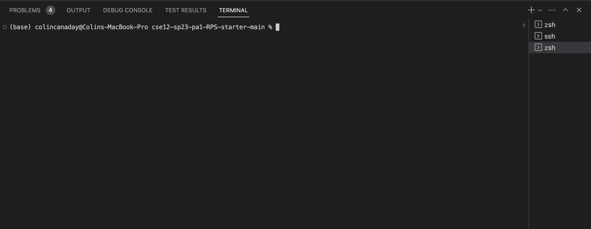
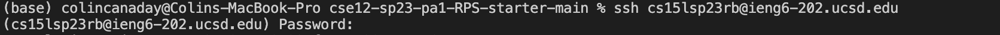
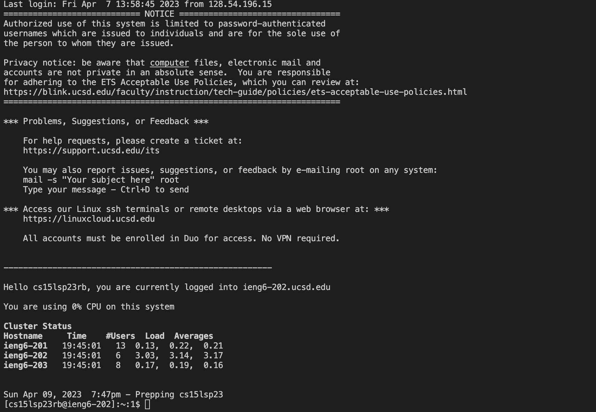
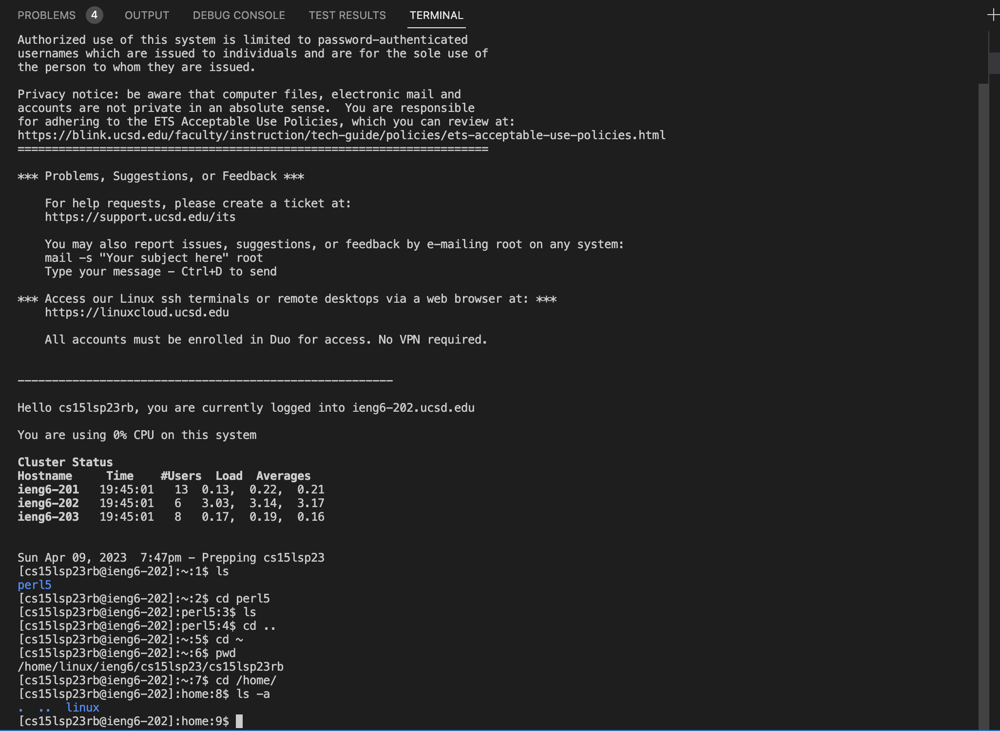

# Lab Report 1

Welcome! In this tutorial I will guide you on the steps required to log in to your account on ieng6.  This task involves 5 simple steps, and only requires a computer, access to the internet, and a web browser.

#### Without further ado, let's begin!

## Step 1: Finding Your Account Name

> This account name will be in the format cs15lsp23zz, with "sp23" referring to the term, and "zz" being a course-specific placeholder

In order to properly log in to your account, you will first need to know the account name, or username, associated with your account. If you already know this, feel free to move on to the next step.

This account name can be found by navigating to the website located [here](https://sdacs.ucsd.edu/~icc/index.php). From there, input your student ID username and PID into the corresponding fields, as shown below.

Once filled in, click the "Submit Query" button, which should bring you to the page shown below, with your account username being listed on the screen, as shown.

## Step 2: Reset Password

> This step is only to be completed for the first login. Otherwise, skip to the next step.

Once you have your account name, it is time to (re)set your password for the associated account.

On the same page that we were on before, click the text that holds your account name. This will update the page such that, at the top of the page, it says "your username is cs15lsp23zz" (with the account name being your own). Now that we are targetting the proper account, you will see text near the top of the page that says "Let's set the password for your account."  Beneath that, press the hyperlink. This should direct you to the page shown below.

From there, navigate to the "Password Change Tool" by pressing the appropriate link, leading you to the page shown below.

Enter the account name found in step 1, and press the "Continue" button. Next, press the link with the text "I want to reset my course-specific account password," follow the instructions for 2FA, and confirm your email address, following the instructions on the screen.

Once you confirm that your email address is correct, you will then recieve an email at that address with the final instructions for (re)setting your password. Follow the instructions listed in the email and corresponding website that is linked, paying close attention to security recommendations when creating your password.
 
## Step 3: Installing VScode

Once we have our account details, we can now install VScode.

Begin by naviagting to the page located [here](https://code.visualstudio.com/). From there, press on the download button corresponding to your operating system.

> In many cases, the browser is able to find your OS type automatically.  In this case, you will just have to click the blue download button on the homepage.

Next, locate the file in your Downloads directory, and open the file.  This should open an installer, or in many cases the app directly.

Follow the steps on the installer/application, paying careful attention to any details listed.

## Step 4: Remotely Connecting

Open your newly installed VScode application, and navigate to the Terminal column at the very top of the application, and within that, click on "New Terminal."

This should open a new interface, as shown below.

Within this interface, type the following, substiuting placeholders with your information:

`$ ssh ACCOUNT-NAME@ieng6.ucsd.edu` 

> Replace "ACCOUNT-NAME" with the account name found in Step 1

After inputting this command by pressing Return/Enter, you should you be prompted for a password.  Enter the password we set in Step 2, noting that there will be no input feedback.  Once complete, once again press Return/Enter.  

> If this is your first time accessing this server through ssh, you will be prompted with a question saying that the authenticity of the server cannot be verified, and then asking whether or not you would like to continue. For the purposes of this tutorial, you may simply type "yes" followed by Return/Enter.

The following interface and dialogue should then be displayed.

## Step 5: Trying Some Commands

Now that we are logged in, we can try out some commands.

In the image below, you can see the usage of some basic commands in this environment, such as `ls`,`cd`, and `pwd `.

## Conclusion

This concludes the tutorial on the steps required to log in to your account on ieng6. In this tutorial, you've learned how to access your account name, change your password, download VScode, open a terminal, SSH into a remote host, and how to use basic commands within that remote host.
